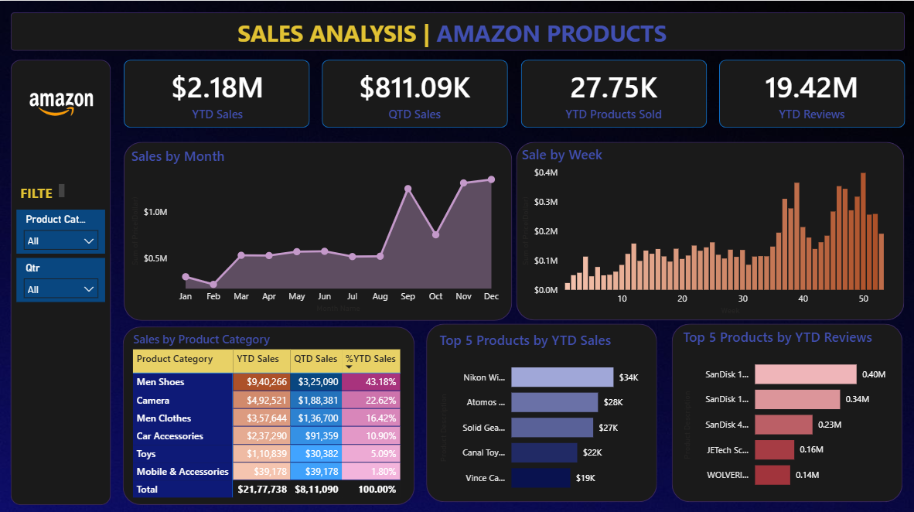

# 📊 Amazon Sales Analysis Dashboard — Power BI

This repository contains a Power BI dashboard that analyzes Amazon product sales with rich visual insights.

## 📌 Overview

The dashboard provides a comprehensive view of:
- 🧾 **Year-To-Date (YTD) & Quarter-To-Date (QTD)** Sales
- 📦 **Products Sold and Reviews**
- 📅 Sales trends **by Month and Week**
- 📊 Performance by **Product Categories**
- 🥇 Top 5 Products by **Sales & Reviews**

## 🖼️ Dashboard Preview

> This interactive dashboard enables data-driven decisions by highlighting sales patterns and product performance metrics.

## 🗂️ Repository Contents

📁 powerbi-amazon-sales/
├── dashboard.pbix <- Power BI report file
├── README.md <- Project documentation
└── amazon-sales-report.png <- Dashboard preview image

## 🛠️ Tools Used

- Microsoft Power BI Desktop
- Sample Sales Dataset (offline)
- Data Visualization Best Practices

## 💡 Key Insights

- Peak sales occur in **Q3–Q4**, especially in **August–December**
- **Men Shoes** dominate the category sales with 43.18% YTD share
- **SanDisk** products are highly reviewed and also top-selling
- **Car Accessories** have the highest QTD growth

---

## 🧠 Author

👩‍💻 Nikitha Pothanapalli  
🎓 B.Tech - Artificial Intelligence & Data Science, GMRIT  
🌐 Passionate about Web Development, Graphic Design and AI Enthusiast

---

## 📌 Note

The `.pbix` file is included for demo purposes only.  
To view and explore, open it using [Power BI Desktop](https://powerbi.microsoft.com/en-us/desktop/).
